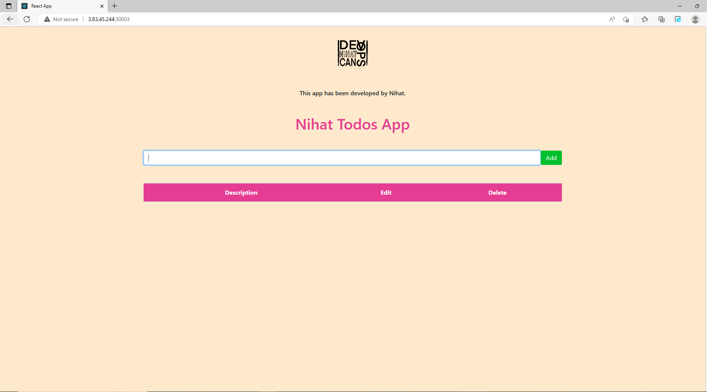

# NIHAT-TODOS-PROJECT

# Descripton:

Hi there!
I am back again with another project. This time I deploy my previous ansible project with Kubernetes.

I aimed to publish the Nihat todos application by using docker, kubernetes and terraform . All you have to do is editing the terraform-files/myvars.auto.tfvars folder with your own values and running the "terraform apply" command inside the terraform-files folder. You will see the page on port 30003 in about 10 minutes.

**WARNING** This terraform files creates an Amazon EC2 instance. You will be billed for the AWS resources used.

# Road Map

 

# Terraform Output

 

# Home Page

# NOTE

Dont forget customize terraform-files/myvars.auto.tfvars file !!

